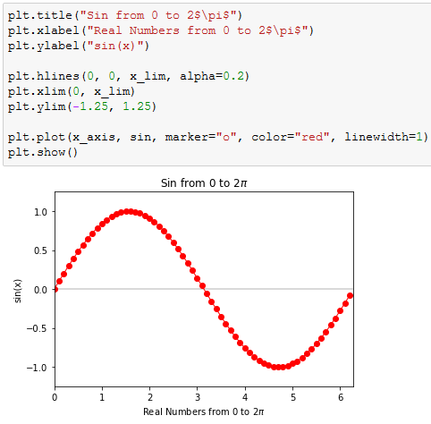
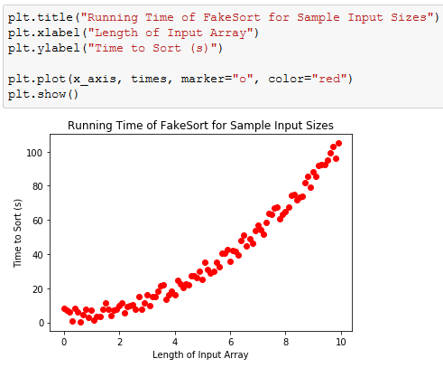
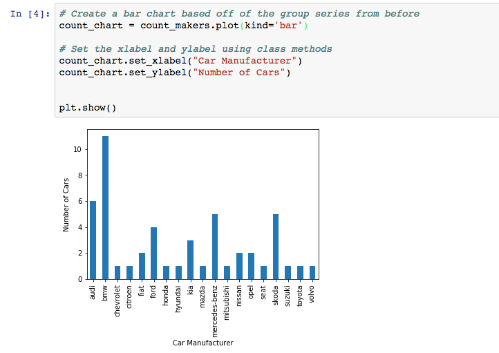
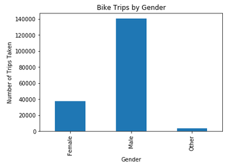
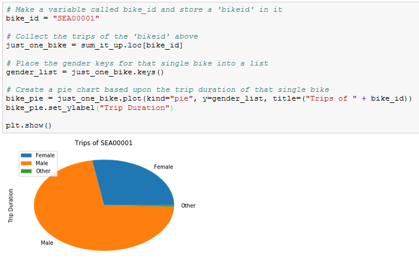
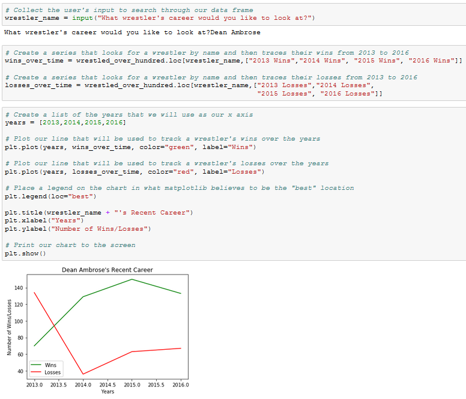

## 5.2 Lesson Plan - Plotting With Pandas

### Overview

Today's lesson plan introduces students to Pandas plotting, a quick and effective means through which to create charts using DataFrames.

### Instructor Notes

* Today's class is rather light in new material. This is due to the fact that plotting charts through Pandas makes visualizing large sets of data even easier than before.

* If your students have trouble displaying plots, there are several recourses.

  * One is to try a different kernel in Jupyter
  * Another is to place `%matplotlib notebook` at the top of the notebook
  * <https://stackoverflow.com/questions/43027980/purpose-of-matplotlib-inline/43028034>

* Have your TAs refer to the [Time Tracker](TimeTracker.xlsx) to stay on track.

### Sample Class Video (Highly Recommended)

* To view an example class lecture visit (Note video may not reflect latest lesson plan): [Class Video](https://codingbootcamp.hosted.panopto.com/Panopto/Pages/Viewer.aspx?id=fbc015bb-bfee-452b-80cd-03b6bab71122)

- - -

### Class Objectives

* Students will  feel comfortable creating plots using the `DataFrame.plot()` method

* Students will understand the advantages and disadvantages of creating charts using the `DataFrame.plot()` method.

* Students will  be able to work their way through a complex data set using Pandas and then chart some visualizations based upon the cleaned DataFrame.

- - -

### 1. Instructor Do: Welcome the Class (0:00)

* Welcome students to class. We'll further extend our foray into creating plots with Python.

### 2. Students Do: PyPlot Warmup (0:15)

* Before diving into the meat and potatoes of today's lesson, provide the class with some time to warm up their minds with some PyPlot drilling exercises. These will not only test student's skills in creating plots, however, but will also see how capable they are at determining what kind of plot fits a data set best.

* Do not open up any examples before slacking out the instructions for this activity. Part of the challenge is for the class to come up with what charts fit the data and, as such, providing them with a screenshot would give it all away.

* **File:**

  * [plot_drills.ipynb](Activities/01-Stu_PlotsReview/Unsolved/plot_drills.ipynb)

* **Instructions:**

  * What kinds of plots match the datasets below?

  ```
  # DATASET 1
  gyms = ["Crunch", "Planet Fitness", "NY Sports Club", "Rickie's Gym"]
  members = [49, 92, 84, 53]

  # DATASET 2
  x_lim = 2 * np.pi
  x_axis = np.arange(0, x_lim, 0.1)
  sin = np.sin(x_axis)

  # DATASET 3
  gyms = ["Crunch", "Planet Fitness", "NY Sports Club", "Rickie's Gym"]
  members = [49, 92, 84, 53]
  colors = ["yellowgreen", "red", "lightcoral", "lightskyblue"]
  explode = (0, 0.05, 0, 0)

  # DATASET 4
  x_axis = np.arange(0, 10, 0.1)
  x_axis = np.arange(0, 10, 0.1)
  times = []
  for x in x_axis:
    times.append(x * x + np.random.randint(0, np.ceil(max(x_axis))))
  ```

  * Create a plot for each of the datasets above, making certain to provide each chart with a title and labels

### 3. Everyone Do: PyPlot Warmup Review (0:05)

* Open up [01-Stu_PlotsReview](Activities/01-Stu_PlotsReview/Solved/plot_drills.ipynb) within the Jupyter Notebook and go through the code line-by-line with the class, answering whatever questions they may have and making certain to discuss the following points.

  * The first dataset is ideal for a bar chart since the programmer is provided with nothing but a list of strings - gym names - and a list of integers - gym memberships - that should be compared against one-another.

  * So as to ensure the graph is as aesthetically pleasing as possible, the tick locations for the X axis are modified so that they fall in the center of their associated bar when the bars are aligned to the edge of the chart. The limits of the X and Y axes are then also modified to ensure there is some separation between the bars and the edge of the chart.

    

  * The second dataset fits a line chart best since the values within the lists change over time in relation to one-another.

  * There is not as much aesthetic editing that needs to be done with this chart other than adding a horizontal line to the chart where the Y axis is equal to 0 so that it is easy to tell when a value is positive or negative.

    

  * While the third dataset obviously fits that which would be used for a pie chart, the only thing that differentiates it from the first is the inclusion of the "colors" list and "explode" tuple. Still, since pie charts are helpful when comparing parts of a whole, the pie chart provides a different perspective than the bar chart from earlier.

  * It is important to note how the axes are being set to "equal" so that the pie chart is circular and that the parameter of `autopct=%1.1%%` is passed into the `plt.pie()` method so as to convert the values within the "members" list into percentages with a single decimal point.

    

  * The final dataset compares the relationship between two lists with unique values. Because of this, a scatter plot is the ideal method through which to visualize the relationship.

  * Scatter plots require very little in the way of aesthetic styling and, as such, the chart really only needs to be drawn in order to look pleasing.

    

### 4. Instructor Do: Plotting Pandas Data	(0:10)

* Point out that that the plots within the previous activity were generated using mock data. In real applications, the data being used will likely come from a Pandas DataFrame since that library allows for such ample customization/cleaning of data sets.

  * Remind students that, when dealing with real data, analysts will typically spend a lot of time "cleaning" it prior to generating any graphics. It is only once the data is clean that they can create an accurate and effective plot.

  * The creators of Pandas realized this and, in a moment of pure genius, built MatplotLib methods into their library so as to allow data analysts to easily generate complex charts in very little time.

* Open and run [02-Ins_PandasPlot](Activities/02-Ins_PandasPlot/Solved/avg_state_rain.ipynb) within Jupyter Notebook to show students how Pandas can be used to create intricate plots and data visualizations using the values stored within DataFrames.

  * Point out that, using PyPlot, it took a lot of code to create a bar chart of average rainfall by state.

  * Scroll down to the "Using Pandas to Chart a DataFrame" section of the application and describe to the class how the original DataFrame is being cut down to only those values which the application should chart. The index for the DataFrame is then set to the "State" column so that Pandas will use these values later on.

  * `DataFrame.plot()` is called and the parameters `kind="bar"` and `figsize=(20,3)` are passed into it. This tells Pandas to create a new bar chart using the values stored within the DataFrame. The values stored within the index will be the labels for the X axis while the values stored within the other column will be used to plot the Y axis.

  * Point out to students how the bar chart produced is automatically styled. The header for the index is now the label for the X axis while the header for the other column has been placed inside of a legend.

  * The chart can still be edited just like any other kind of PyPlot as well. For example, the title for the chart can still be set using `plt.title()`.

    

  * Pandas will plot multiple columns so long as the DataFrame contains multiple columns of data within it.

  * It is also possible to modify a specific Pandas plot by storing the plot within a variable and then using built-in methods to modify it. For example: `PandasPlot.set_xticklabels()` will allow the user to modify the tick labels on the X axis without having to manually set the DataFrame's index.

    

  * If an individual wished to use a different plotting type, they would simply want to change the "kind" that is being passed as a parameter.

### 5. Students Do: Battling Kings (0:20)

* The class will now take some time in order to create a bar chart that visualizes what kings within the Game of Thrones universe have participated in the most battles. This means that students will need to clean up and analyze a Pandas DataFrame before creating their plot.

* Open up [03-Stu_BattlingKings](Activities/03-Stu_BattlingKings/Solved/battling_kings.ipynb) within the Jupyter Notebook and run the code to show the end results of the application.

  

* **Files:**

  * [battling_kings.ipynb](Activities/03-Stu_BattlingKings/Unsolved/battling_kings.ipynb)

  * [got.csv](Activities/03-Stu_BattlingKings/Unsolved/Resources/got.csv)

* **Instructions:**

  * Use Pandas to load the `got.csv` data set.

  * Create a Series containing the number of times each king was an attacker.

  * Create a Series containing the number of times each king was a defender.

  * Combine these two variables into a single Series. _Hint_: How should you combine these two Series? Can you add Series in Pandas?

  * Use your combined data to retrieve labels for your x-ticks.

  * Create a red bar chart, and set its x-tick labels appropriately.

  * Add a title and labels to your plot.

  * Display your plot. Who participated in the most battles? The least?

### 6. Everyone Do: Battling Kings Review (0:05)

* Open up [03-Stu_BattlingKings](Activities/03-Stu_BattlingKings/Solved/battling_kings.ipynb) within the Jupyter Notebook and go through the code line-by-line with the class, answering whatever questions they may have and making certain to discuss the following points.

  * Since the primary purpose of this chart will be to uncover which kings have participated in the most battles, it is crucial to collect the `value_counts()` of both the "attacking_king" and "defending_king" columns.

  * The values contained within these two Pandas Series should be added together in order to calculate the total battles each king was in. This should be done using `Series.add(OtherSeries, fill_value=0)` so that the two kings who have only been on the defending sides of battles will be added properly.

  * All that needs to be done from this point on is use `DataFrame.plot(kind="bar")` so as to create the plot desired.

    

### 7. Instructor Do: Plotting Groups (0:05)

* While plotting DataFrames is impressive enough on its own, Pandas also includes methods that allow users to plot GroupBy objects. This allows data analysts to very easily create charts that based on summary data.

* Open up [04-Ins_GroupPlots](Activities/04-Ins_GroupPlots/Solved/plotting_groups.ipynb) within Jupyter Notebook and run through the code with the class.

  * The data being accessed and utilized within this example takes used car data from Germany and thus allows users to determine what categories influence the pricing of a car.

  * Within this application, the original DataFrame is grouped by the values contained within the "maker" column. Those values are then counted and eventually charted using Pandas.

  * When charting a GroupBy element, some analysis must have been performed beforehand. Without performing some kind of analysis, the chart would simply look the same as if the original DataFrame had been plotted.

    

### 8. Students Do: Bike Trippin (0:20)

* Students will now create a pair of charts based upon community bike data collected from Seattle, Washington. This activity will require them to create/analyze GroupBy objects before printing some visualizations of their findings to the screen.

* Open up [05-Stu_BikeTrippin](Activities/05-Stu_BikeTrippin/Solved/bike_trippin.ipynb) within the Jupyter Notebook and run the code to show the end results of the application.

  
  

* **Files:**

  * [bike_trippin.ipynb](Activities/05-Stu_BikeTrippin/Unsolved/bike_trippin.ipynb)

  * [trip.csv](Activities/05-Stu_BikeTrippin/Resources/trip.csv)

* **Instructions:**

  * Create a bar chart using Pandas and MatplotLib that visualizes how many individual bike trips were taken by each gender.

  * Create a pie graph using Pandas and MatplotLib that can be used to visualize the trip duration of a single bike split up by gender.

* **Hint:**

  * There is a buggy value stored within the "gender" column of the original DataFrame. In order to create an accurate chart, this value will need to be found and removed.

### 9. Everyone Do: Bike Trippin Review (0:05)

* Open up [05-Stu_BikeTrippin](Activities/05-Stu_BikeTrippin/Solved/bike_trippin.ipynb) within the Jupyter Notebook and go through the code line-by-line with the class, answering whatever questions they may have and making certain to discuss the following points.

  * For the bar chart, the original DataFrame is grouped by the values within the "gender" column and counted.

  * The Series returns with a Series containing a buggy value called "stoptime". This row in the Series must be dropped so that the data can be charted accurately.

  * The title for the chart is set within the `DataFrame.plot()` method while the X and Y labels are set using `PandasPlot.set_xlabel()` and `PandasPlot.set_ylabel()`

    

  * For the pie chart, the original DataFrame is grouped by both the "bikeid" and "gender" columns. When the sum analyses is performed, therefore, a DataFrame containing multiple indexes is returned so that the duration is calculated per gender per bike.

    

  * In order to create a chart based on one bike alone, `loc[]` must be used in order and a single "bikeid" must be passed. This returns a Series with only the "gender" column as the index and "tripduration" as the value.

  * When creating a pie chart, a Y value must be passed into the `plot()` method. This lets Pandas know what values should be set as labels.

  * The title for the pie chart is being dynamically set by concatenating strings.

    

- - -

### 10. BREAK (0:15)

- - -

### 11. Students Do: Miles Per Gallon (0:15)

* The class will now take some time to create a scatter plot using vehicle data, Pandas, and MatplotLib.

* Open up [06-Stu_MilesPerGallon](Activities/06-Stu_MilesPerGallon/Solved/mpg.ipynb) within the Jupyter Notebook and run the code to show the end results of the application.

  

* **Files:**

  * [mpg.ipynb](Activities/06-Stu_MilesPerGallon/Solved/mpg.ipynb)

  * [MPG.csv](Activities/06-Stu_MilesPerGallon/Resources/mpg.csv)

* **Instructions:**

  * Create a scatter plot using the data provided, Pandas, and MatplotLib which compares the MPG of a vehicle with its horsepower.

### 12. Everyone Do: Miles Per Gallon Review (0:05)

* Open up [06-Stu_MilesPerGallon](Activities/06-Stu_MilesPerGallon/Solved/mpg.ipynb) within the Jupyter Notebook and go through the code line-by-line with the class, answering whatever questions they may have and making certain to discuss the following points.

  * There are quite a few rows in the original dataset that include missing values. These rows are filtered out using a `loc[]` filter that looks for any rows that do not contain a "?" value.

  * The data stored within the "horsepower" column is not numeric by default. This is due to the "?" values that were there and, as such, `pandas.to_numeric()` must be used to convert the column into a usable format.

  * The `x` and `y` parameters in `DataFrame.plot()` allow users to specify which columns they would like to chart. This allows the user to create graphs without having to filter the DataFrame down to only two columns.

    

### 13. Instructor Do: Plotting Multiple Lines (0:05)

* In this activity, we will explore creating the same multiplot with Matplotlib, then with pandas.

* Open up [07-Ins_PandasMultiLine](Activities/07-Ins_PandasMultiLine/Solved/unemploy_chart.ipynb) within Jupyter Notebook and run through the code with the class.

  * Explain to the class how this data which keeps track of international unemployment numbers has been split up between two different CSV files and, as such, must be merged together.

  * After the merging has taken place, the duplicate "Country Code" column should be deleted and the original "Country Code" column reset to its original name.

    

  * The average unemployment rate across the entire globe can be found by finding the means of the DataFrame.

  * Since all of the years are stored within the column headers, they can be collected by taking the Series created by the means calculation and looking into its keys.

    

  * The two line plots are then created using `plt.plot()`, the first using the average unemployment findings for its Y values whilst the other takes in the values of a single row. The X values for both of the charts should be the "years" list created earlier.

  * The tuples method discussed during the previous class is used to create the legend for the plots.

    

* Demonstrate that the identical plot can be created with pandas:

    

* Although pandas plots are generally less flexible and customizable than Matplotlib, it is nonetheless capable of generating many common charts.

### 14. Groups Do: Winner Wrestling - Part I (0:15)

* The rest of class will be dedicated to creating a plot using Pandas and MatplotLib that allows its viewers to visualize the recent career of professional wrestlers.

* This mini-project has been broken down into three parts and was designed for students to work alongside each other in groups.

* In this first part, students will take four separate CSV files and merge them together. They will then need to rename and style the columns so that they reflect the data properly.

* Open up [08-Stu_WinnerWrestling-Part1](Activities/08-Stu_WinnerWrestling-Part1/Solved/winning_wrestlers.ipynb) within the Jupyter Notebook and run the code to show the end results of the application.

  

* **Files:**

  * [winning_wrestlers.ipynb](Activities/08-Stu_WinnerWrestling-Part1/Solved/winning_wrestlers.ipynb)
  * [WWE-Data-2013.csv](Activities/08-Stu_WinnerWrestling-Part1/Resources/WWE-Data-2013.csv)
  * [WWE-Data-2014.csv](Activities/08-Stu_WinnerWrestling-Part1/Resources/WWE-Data-2014.csv)
  * [WWE-Data-2015.csv](Activities/08-Stu_WinnerWrestling-Part1/Resources/WWE-Data-2015.csv)
  * [WWE-Data-2016.csv](Activities/08-Stu_WinnerWrestling-Part1/Resources/WWE-Data-2016.csv)

* **Instructions:**

  * The instructions for this activity are contained in the unsolved Jupyter notebook file.

### 15. Everyone Do: Winner Wrestling - Part I Review (0:05)

* Open up [08-Stu_WinnerWrestling-Part1](Activities/08-Stu_WinnerWrestling-Part1/Solved/winning_wrestlers.ipynb) within the Jupyter Notebook and go through the code line-by-line with the class, answering whatever questions they may have and making certain to discuss the following points.

  * The DataFrames should be merged together on the "Wrestler" column using an outer join. This ensures that no data will be lost even if the wrestler is unique to a single CSV.

  * As DataFrames are merged, columns should be renamed so that it is clear what year the wins, losses, and draws are from.

  * While it is possible to merge all of the DataFrames together using one incredibly long series of nested merge statements, it is far simpler to merge the DataFrames together a pair at a time. This allows the programmer to modify columns as they go along and lessens the risk of naming a column incorrectly.

    

### 16. Groups Do: Winner Wrestling - Part II (0:10)

* In this second part, groups will create new columns for their DataFrame which will inform readers of how many matches a wrestler has won, lost, drawn, and taken part in over the course of their career.

* Open up [09-Stu_WinnerWrestling-Part2](Activities/09-Stu_WinnerWrestling-Part2/Solved/winning_wrestlers.ipynb) within the Jupyter Notebook and run the code to show the end results of the application.

  

* **Files:**

  * [winning_wrestlers.ipynb](Activities/08-Stu_WinnerWrestling-Part1/Solved/winning_wrestlers.ipynb)
  * [WWE-Data-2013.csv](Activities/08-Stu_WinnerWrestling-Part1/Resources/WWE-Data-2013.csv)
  * [WWE-Data-2014.csv](Activities/08-Stu_WinnerWrestling-Part1/Resources/WWE-Data-2014.csv)
  * [WWE-Data-2015.csv](Activities/08-Stu_WinnerWrestling-Part1/Resources/WWE-Data-2015.csv)
  * [WWE-Data-2016.csv](Activities/08-Stu_WinnerWrestling-Part1/Resources/WWE-Data-2016.csv)

* **Instructions:**

  * The instructions for this activity are contained within the unsolved version.

### 17. Everyone Do: Winner Wrestling - Part II Review (0:05)

* Open up [09-Stu_WinnerWrestling-Part2](Activities/09-Stu_WinnerWrestling-Part2/Solved/winning_wrestlers.ipynb) within the Jupyter Notebook and go through the code line-by-line with the class, answering whatever questions they may have and making certain to discuss the following points.

  * In order to calculate the total number of wins, losses, or draws simply add up the values within the corresponding columns for each wrestler and place the output within a new column.

  * To calculate the total number of matches, simply add up the total wins, losses, and draws for each wrestler and place the output within a new column.

  * To filter out those wrestlers who have not wrestled more than 100 matches, simply use a `loc[]` filter and check that the "Total Matches" column is greater than or equal to 100.

    

### 18. Groups Do: Winner Wrestling - Part III (0:15)

* In this final part, the class will take the DataFrame they created and, using MatplotLib, chart the number of wins and losses an individual wrestler had over the course of their recent career.

* Open up [10-Stu_WinnerWrestling-Part3](Activities/10-Stu_WinnerWrestling-Part3/Solved/winning_wrestlers.ipynb) within the Jupyter Notebook and run the code to show the end results of the application.

  

* **Files:**

  * [winning_wrestlers.ipynb](Activities/10-Stu_WinnerWrestling-Part3/Solved/winning_wrestlers.ipynb)
  * [WWE-Data-2013.csv](Activities/10-Stu_WinnerWrestling-Part3/Resources/WWE-Data-2013.csv)
  * [WWE-Data-2014.csv](Activities/10-Stu_WinnerWrestling-Part3/Resources/WWE-Data-2014.csv)
  * [WWE-Data-2015.csv](Activities/10-Stu_WinnerWrestling-Part3/Resources/WWE-Data-2015.csv)
  * [WWE-Data-2016.csv](Activities/10-Stu_WinnerWrestling-Part3/Resources/WWE-Data-2016.csv)

* **Instructions:**

  * The instructions for this activity are contained within the unsolved version.

### 19. Everyone Do: Winner Wrestling - Part II Review (0:05)

* Open up [10-Stu_WinnerWrestling-Part3](Activities/10-Stu_WinnerWrestling-Part3/Solved/winning_wrestlers.ipynb) within the Jupyter Notebook and go through the code line-by-line with the class, answering whatever questions they may have and making certain to discuss the following points.

  * Inputs can still function within Jupyter Notebook. Whenever the cell containing the input line is run, a prompt will be printed within the space beneath it and will allow for a user to add in their response.

  * Two Series must be created for the graph using `loc[]` filtering. Both look for the row with a wrestler name equal to that which the user inputted. The first Series takes all of the values in the "Wins" columns whilst the second Series takes all of the values in the "Losses" columns.

  * The "years" list that will serve at the chart's X axis can be made manually since the years are consistent and known to the programmer.

  * While the `Series.plot()` method could theoretically be used to create both the "Wins" and "Losses" plots, since the data is stored within different data types it is actually easier to use the `plt.plot()` method instead.

    

- - -

### LessonPlan & Slideshow Instructor Feedback

* Please click the link which best represents your overall feeling regarding today's class. It will link you to a form which allows you to submit additional (optional) feedback.

* [:heart_eyes: Great](https://www.surveygizmo.com/s3/4381674/DataViz-Instructor-Feedback?section=5.2&lp_useful=great)

* [:grinning: Like](https://www.surveygizmo.com/s3/4381674/DataViz-Instructor-Feedback?section=5.2&lp_useful=like)

* [:neutral_face: Neutral](https://www.surveygizmo.com/s3/4381674/DataViz-Instructor-Feedback?section=5.2&lp_useful=neutral)

* [:confounded: Dislike](https://www.surveygizmo.com/s3/4381674/DataViz-Instructor-Feedback?section=5.2&lp_useful=dislike)

* [:triumph: Not Great](https://www.surveygizmo.com/s3/4381674/DataViz-Instructor-Feedback?section=5.2&lp_useful=not%great)

- - -

### Copyright

Trilogy Education Services © 2018. All Rights Reserved.
